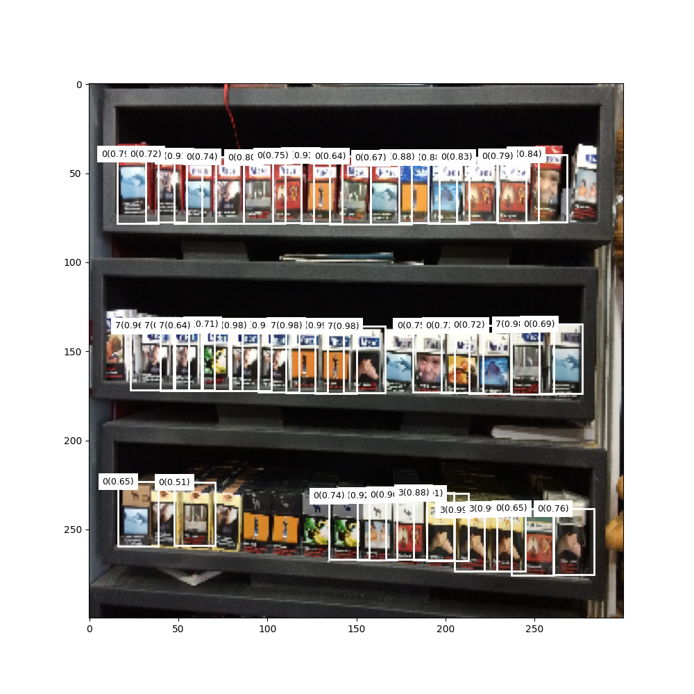

# Overview
This repository contains the scripts and notebooks used for data analysis, data preparation, model training and evaluation. The model has achieved a Mean Average Precision of 0.88 at 0.5 IOU threshold with a precision of 0.8 and recall of 0.004. 


# Project Details

## Data Analysis
The `Analysis.ipynb` in the Notebooks folder contains the code and explanation for splitting the dataset. The following points summarizes the notebook:

1. The brand id labels is increased by 1 since background predictions will be labelled 0 during training.
2. The average aspect ratio is identified as 0.65 which will be used as the aspect ratio for generating anchor boxes during training for each feature map cel
3. The training dataset is split by 10% for validation.
4. The loss weight for each label is identified for accounting the imbalance in the dataset. The following are the weights:
```
 1: 0.0064
 2: 0.2218
 3: 0.0675
 4: 1.0064
 5: 0.1636
 6: 0.5915
 7: 0.3549
 8: 0.2168
 9: 0.3458
 10: 0.8645
 11: 0.8991
```  

## Data Augmentation and Preprocessing 
To account for the small dataset size, we also apply data augmentations as mentioned in the origin Single shot detector paper [1].

1. Randomly adjust brightness, contrast, saturation, and hue, each with a 50% chance and in random order.

2. With a 50% chance, perform a zoom out operation on the image. This helps with learning to detect small objects. The zoomed out image must be between 1 and 4 times as large as the original. The surrounding space could be filled with the mean of the ImageNet data.

3. Randomly crop image, i.e. perform a zoom in operation to detect large or partial objects. Some objects may even be cut out entirely. Crop dimensions are to be between 0.5 and 1 times the original dimensions. The aspect ratio is to be between 0.5 and 2. Each crop is made such that there is at least one bounding box remaining that has a Jaccard overlap of either 0, 0.1, 0.3, 0.5, 0.7, or 0.9, randomly chosen, with the cropped image. In addition, any bounding boxes remaining whose centers are no longer in the image as a result of the crop are discarded.

4. With a 50% chance, horizontally flip the image.

5. Resize the image to 300, 300 pixels.

6. Convert all boxes from absolute to fractional boundary coordinates. 

7. Normalize the image with the mean and standard deviation of the ImageNet data that was used to pretrain our VGG base.


## Architecture

The architecture used is the same as proposed in [1]. 

### Base Architecture

Pretrained VGG16. The feature maps from two convolutions are used for prediction (`conv_4` & `conv_7`).

### Auxiliary Convolutions

These module is used for generating 4 higher level feature maps(`conv8_2`, `conv9_2`, `conv10_2` and `conv11_2`). The parameters are initialized with Xavier initialization method.

### Prediction Convolutions

Here the bounding box and classification predictions are made from the above feature map. Each channel in the output corresponds to a prediction of either a bbox coordinate or class. The dimension of each generated feature map are:
```
'conv4_3': 38,
'conv7': 19,
'conv8_2': 10,
'conv9_2': 5,
'conv10_2': 3,
'conv11_2': 1
```

## Training Protocol

### Creating Anchor boxes

We use the following scales for the six feature maps according to [1].

```
'conv4_3': 0.1,
'conv7': 0.2,
'conv8_2': 0.375,
'conv9_2': 0.55,
'conv10_2': 0.725,
'conv11_2': 0.9
```

The aspect ratio of anchor boxes is 0.66. A total of 1940 anchor boxes are generated.

### Training

Adam Optimizer with learning rate 0.0005 and 0.001 for weights and biases, respectively. The batch size was 8. The model is trained for 100 epochs and checkpointed when the running validation loss is lowest.

The loss functions used are cross entropy and L1 loss for classification and localization. l1_loss only on positive labels (non-background labels)

To account for the high number of background predictions and consequently class imbalance, hard negative mining is performed. Only three times of the number of true labels in a training example background predictions are used with highest cross entropy loss. 

The following used to then compute the classification loss:

```
L_conf = (sum of positive CE loss + sum of hard negative CE loss)/no.of positive examples
``` 

The weight of the background class for cross entropy loss is arbitrarily chosen as 0.5.

The final loss is 

```
loss = L_conf + l1_loss 
```
# Results

```
"mAP": 0.881
"precision": 0.808
"recall": 0.004
```
All predictions on the images with bounding boxes can be accessed [here](https://drive.google.com/drive/folders/1chSntwWw9ESNJaJYm_lk5ErCSs69tonq?usp=sharing). The labels are in the format `class_prediction(confidence)`.


One hypothesis for lower recall is the use of a fixed aspect ratio. Consequently, when prodcuts of significantly different aspect ratio appear, the model fails to detect them.  


# Q & A
<b> What is the purpose of using multiple anchors per feature map
cell? </b>

<p>
Multiple anchor cells are used to account for different aspect ratios of the object at different scales. 
A single feature map proposes anchor boxes at a particular scale with different aspect ratios at each cell.
</p>

<b>2. Does this problem require multiple anchors? Please justify your
answer</b>
<p>
Yes. From a visual perspective all target objects have a rectangular shape with width smaller than height (aspect ratio < 1). 
From a quantitative metric, the average of the aspect ratio in the dataset was about 0.66 with a small standard deviation (0.07). Consequently, an aspect ratio of 0.65 was used for each feature map anchor box.

However, if the images are reshaped or taken from a different perspective, the aspect ratio of the products changes. This is evident in the following test image, where the aspect ratio of each product is seemingly much greater than 0.65 and the model fails to detect it. Consequenly, the model trained has low recall. 


</p>


# Setup

```
cd 
pip install -e .
```


## Training

```
python src/scripts/train.py --config_file configs/vgg_config.yaml
```

## Evaluation

You can download the model from [this link](https://drive.google.com/drive/folders/1-1bnPuKF_IFjnRIHru2Rv5NNxw1--zf4?usp=sharing)

```
!python src/scripts/evaluate_detector.py --checkpoint_path checkpoints/best_model.pth --dataset_path "dataset/GroceryDataset_part1.tar-2/ShelfImages/test" --annotation_path "dataset/testing_annotations.csv"
```

## Detect Products in an image

```
python src/scripts/detect_objects.py --checkpoint_path model_path/best_model.pth --image C1_P10_N2_S3_1.JPG
```


# Acknowlegdgements

[1]. Liu et al, "SSD: Single Shot Multibox Detector", ECCV, 2016

The code in this project is adapted from


1. [d2l.ai](d2l.ai)
2. [A-PyTorch-Tutorial-to-Object-Detection
](https://github.com/sgrvinod/a-PyTorch-Tutorial-to-Object-Detection#implementation)